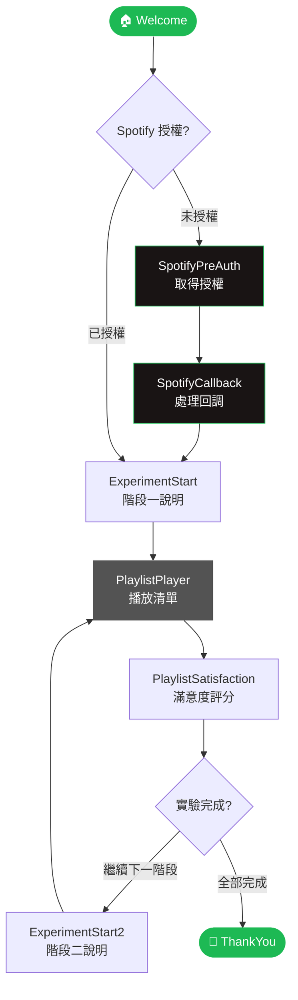
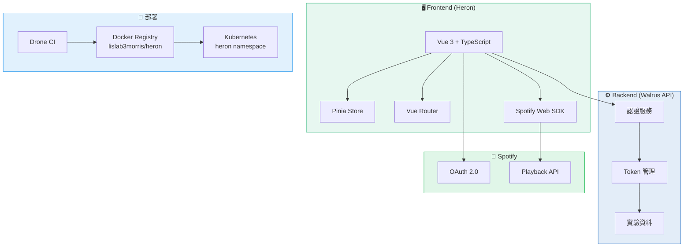
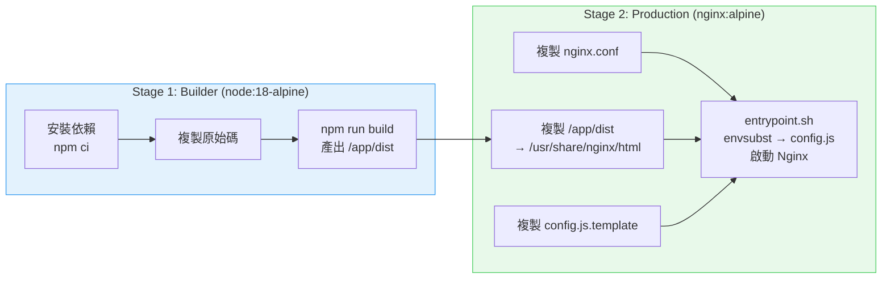
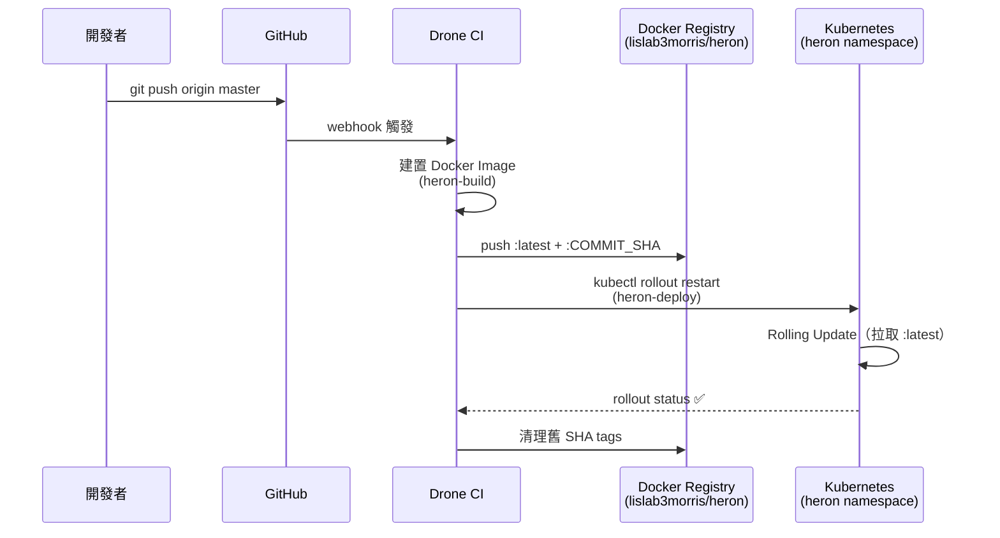
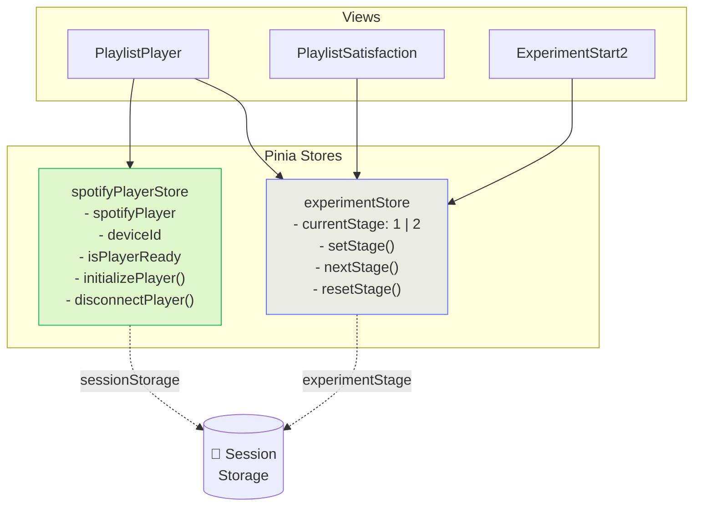

<div align="center">

# 🎵 Heron

**音樂熟悉度播放清單實驗平台**

*A Spotify-powered familiarity playlist experiment system*

[](https://vuejs.org/)
[](https://www.typescriptlang.org/)
[](https://tailwindcss.com/)
[](https://vitejs.dev/)
[](https://www.docker.com/)

</div>

---

## 📖 專案簡介

**Heron** 是一套以 Spotify 為核心的音樂熟悉度實驗系統，用於研究使用者在不同熟悉程度播放清單下的聆聽行為與滿意度。系統透過 Spotify Web Playback SDK 進行即時播放控制，並整合後端 Walrus API 管理實驗資料。

---

## ✨ 功能特色

| 功能 | 說明 |
|------|------|
| 🎵 **Spotify 整合** | 透過 Web Playback SDK 進行無縫播放控制 |
| 🧪 **實驗流程管理** | 支援多階段實驗設計（Stage 1 / Stage 2） |
| 📊 **滿意度問卷** | 播放後即時收集使用者回饋 |
| 🌐 **OAuth 認證** | Spotify OAuth 2.0 授權流程 |
| 💾 **本地狀態持久化** | 使用 sessionStorage 保存實驗進度 |
| 📱 **響應式設計** | 支援桌面與行動裝置 |
| 🐳 **容器化部署** | Docker + Nginx 生產環境部署 |
| 🚀 **CI/CD 自動化** | Drone CI 自動建置並部署至 Kubernetes |

---

## 🗺️ 實驗流程



---

## 🏗️ 系統架構



---

## 📁 專案結構

```
heron/
├── src/
│   ├── components/
│   │   ├── FeatureCard.vue       # 功能卡片元件
│   │   └── ParticleBackground.vue # Three.js 粒子背景
│   ├── views/
│   │   ├── Welcome.vue           # 歡迎頁
│   │   ├── SpotifyPreAuth.vue    # Spotify 授權前置頁
│   │   ├── SpotifyCallback.vue   # OAuth 回調處理
│   │   ├── SpotifyIframe.vue     # Spotify 嵌入式播放器
│   │   ├── ExperimentStart.vue   # 實驗階段一說明
│   │   ├── ExperimentStart2.vue  # 實驗階段二說明
│   │   ├── PlaylistPlayer.vue    # 播放清單播放器
│   │   ├── PlaylistSatisfaction.vue # 滿意度評分
│   │   └── ThankYou.vue          # 感謝頁
│   ├── stores/
│   │   ├── experiment.ts         # 實驗階段狀態管理
│   │   └── spotifyPlayer.ts      # Spotify 播放器單例
│   ├── services/
│   │   └── api.ts                # API 服務層
│   ├── utils/
│   │   ├── api.ts                # HTTP 請求工具
│   │   ├── userStorage.ts        # sessionStorage 管理
│   │   └── index.ts              # 通用工具函數
│   ├── types/
│   │   └── index.ts              # TypeScript 型別定義
│   ├── config/
│   │   └── environment.ts        # 環境設定（讀取 window.CONFIG）
│   ├── router/
│   │   └── index.ts              # 路由配置
│   ├── App.vue                   # 根元件
│   ├── main.ts                   # 應用程式入口
│   └── style.css                 # 全域樣式
├── public/
│   ├── config.js                 # 本地開發用 runtime 設定
│   └── favicon.svg               # 應用程式圖示
├── config.js.template            # 容器啟動時 envsubst 的模板
├── entrypoint.sh                 # 容器入口：注入 config.js 後啟動 Nginx
├── Dockerfile                    # 多階段建構配置
├── nginx.conf                    # Nginx 設定
├── .drone.jsonnet                # Drone CI/CD 設定來源（jsonnet）
└── .drone.yml                    # Drone CI/CD 流程（由 jsonnet 生成）
```

---

## 🚀 快速開始

### 系統需求

- **Node.js** 18.0+
- **npm** 9.0+
- **Docker**（用於容器化部署）
- **Spotify Premium 帳號**（使用 Web Playback SDK 需要）

### 1. 安裝依賴

```bash
npm install
```

### 2. 本地環境設定

編輯 `public/config.js`：

```js
window.CONFIG = {
  WALRUS_API_BASE_URL: "http://localhost:8000",
  ENV: "local",
  APP_TITLE: "LISLab3 Spotify Experiment"
};
```

### 3. 啟動開發伺服器

```bash
npm run dev
```

應用程式將在 `http://localhost:5173` 啟動。

---

## 📝 可用指令

```bash
# 開發
npm run dev          # 開發模式

# 建構
npm run build        # 生產建構

# 品質工具
npm run lint         # ESLint 檢查
npm run format       # Prettier 格式化

# 預覽
npm run preview      # 預覽建構結果
```

---

## 🐳 Docker 部署

### 本地建構

```bash
docker build -t heron:latest .
```

### 啟動容器

環境變數在容器啟動時透過 `entrypoint.sh` 注入至 `config.js`：

```bash
docker run -d -p 80:80 \
  -e WALRUS_API_BASE_URL=https://walrus.lab3.website \
  -e ENV=staging \
  -e APP_TITLE="LISLab3 Spotify Experiment" \
  heron:latest
```

### Docker 多階段建構流程



---

## 🔄 CI/CD 流程

Drone CI 在推送至 `master` 分支時自動觸發：



> CI/CD 設定以 `.drone.jsonnet` 為來源，執行 `jsonnet .drone.jsonnet | yq -P - > .drone.yml` 重新生成。

---

## 🔧 狀態管理

### Pinia Stores 架構



---

## 🌐 路由結構

| 路徑 | 元件 | 說明 |
|------|------|------|
| `/` | → `/welcome` | 自動重導向 |
| `/welcome` | `Welcome` | 歡迎頁面 |
| `/spotify-pre-auth` | `SpotifyPreAuth` | Spotify 授權前置 |
| `/spotify-callback` | `SpotifyCallback` | OAuth 回調處理 |
| `/spotify-iframe` | `SpotifyIframe` | 嵌入式播放器 |
| `/experiment-start` | `ExperimentStart` | 實驗階段一說明 |
| `/experiment-start-2` | `ExperimentStart2` | 實驗階段二說明 |
| `/playlist-player` | `PlaylistPlayer` | 播放清單播放器 |
| `/playlist-satisfaction` | `PlaylistSatisfaction` | 滿意度評分頁 |
| `/thank-you` | `ThankYou` | 實驗完成感謝頁 |

---

## 🔒 Runtime 設定

環境變數不在 build time 注入，而是容器啟動時透過 `envsubst` 寫入 `config.js`，前端讀取 `window.CONFIG`。

| 變數名稱 | 說明 | 範例 |
|----------|------|------|
| `WALRUS_API_BASE_URL` | Walrus 後端 API 位址 | `https://walrus.lab3.website` |
| `ENV` | 執行環境 | `local` / `staging` |
| `APP_TITLE` | 應用程式標題 | `LISLab3 Spotify Experiment` |

本地開發直接編輯 `public/config.js`，此檔案不會被打包進 dist。

---

## 📄 授權

此專案使用 **MIT 授權** — 詳見 [LICENSE](LICENSE) 檔案。

---

<div align="center">

Made with ❤️ by **Lab3-Spotify Team**

</div>
